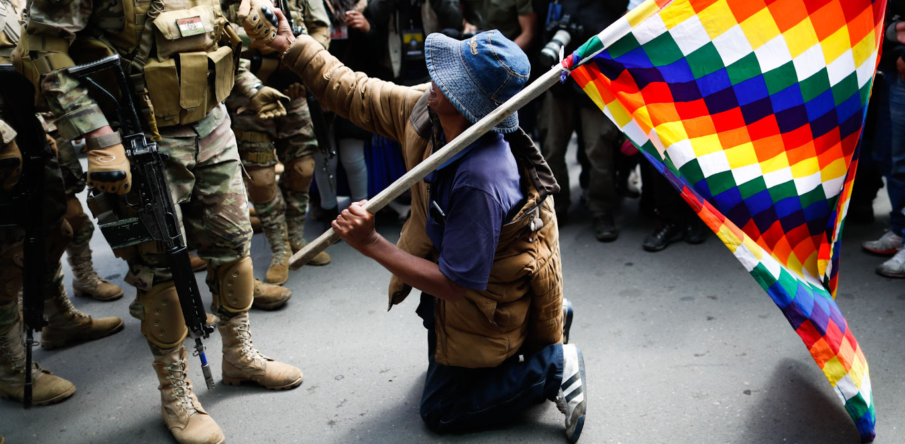
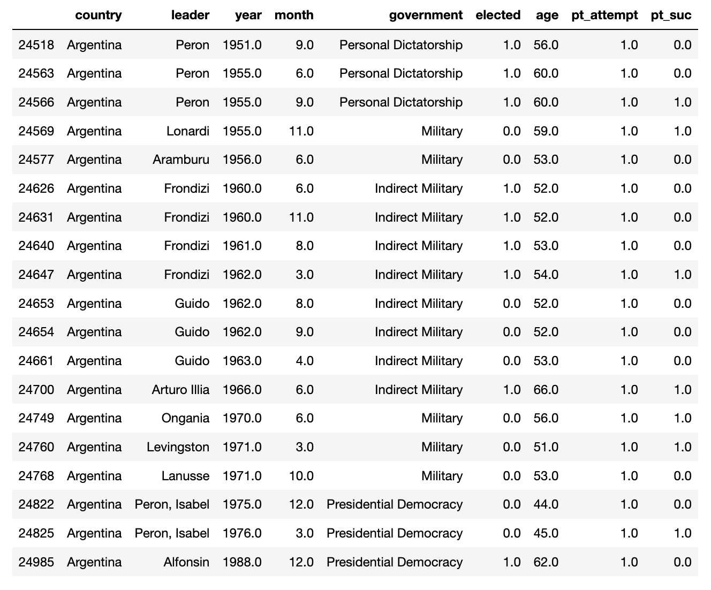
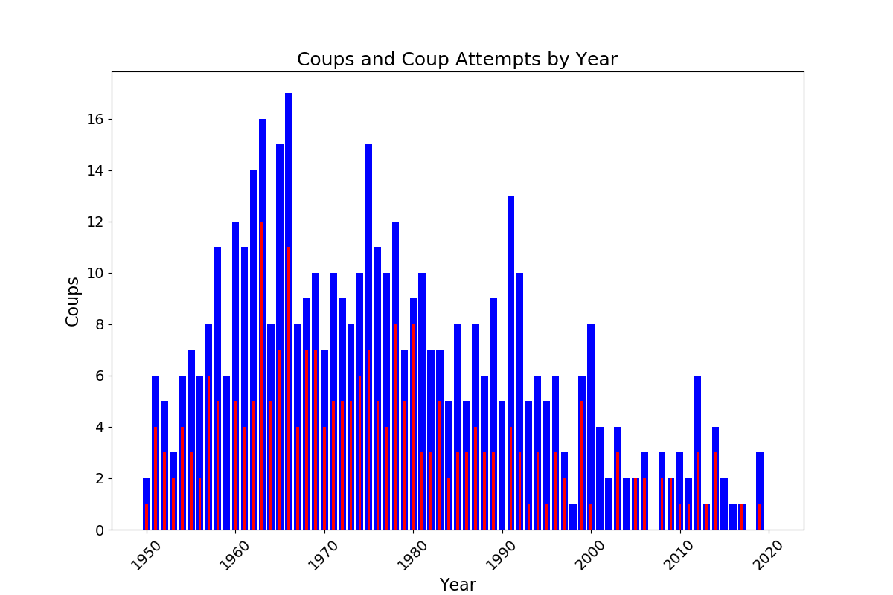
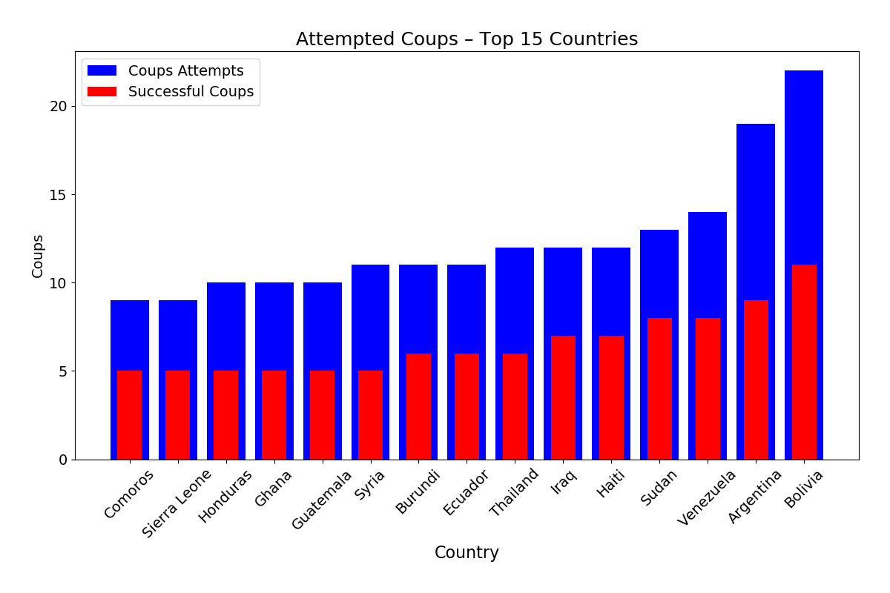
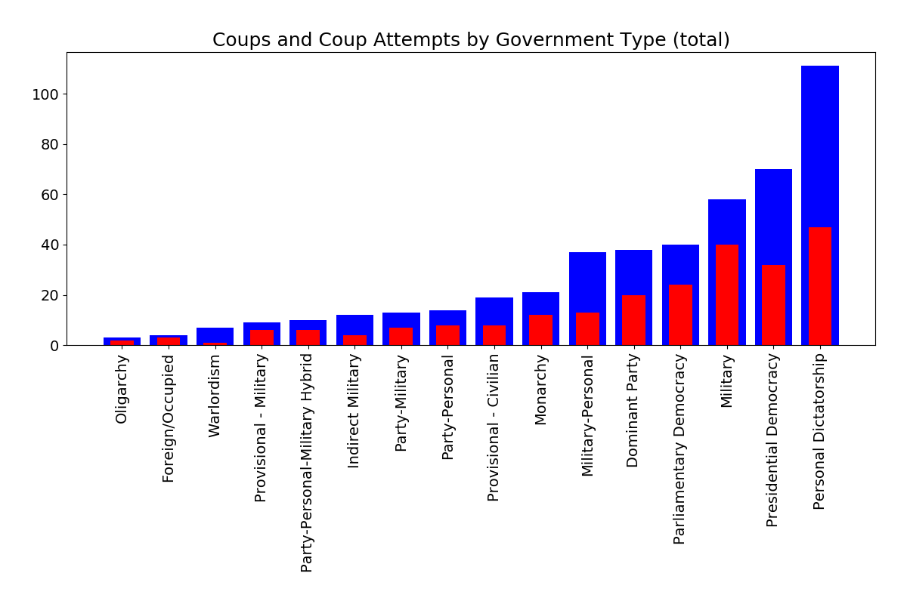
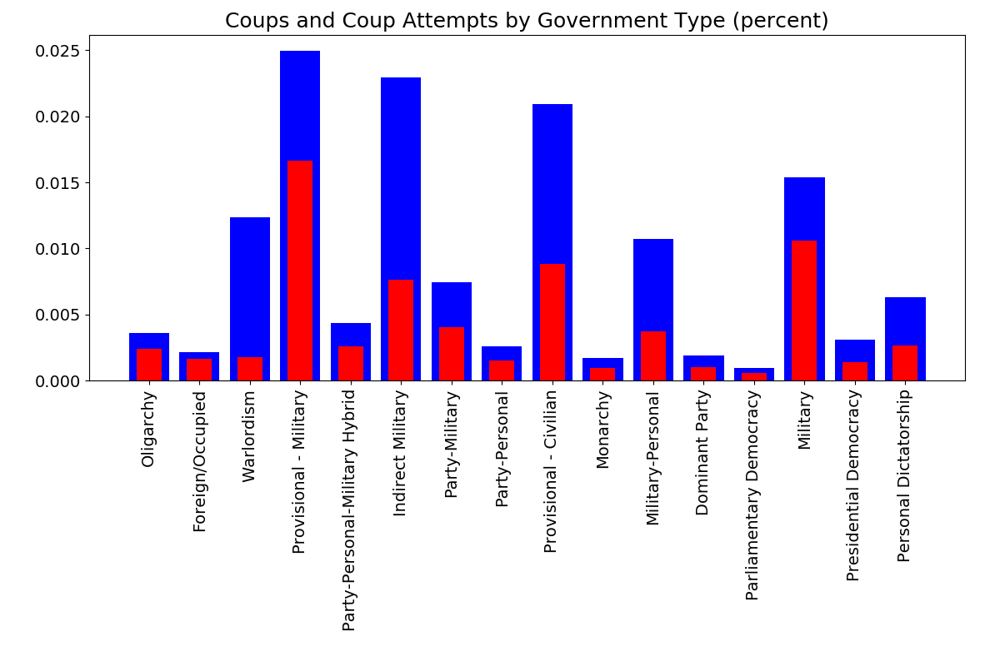
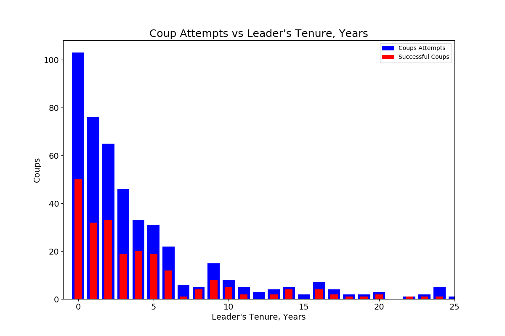
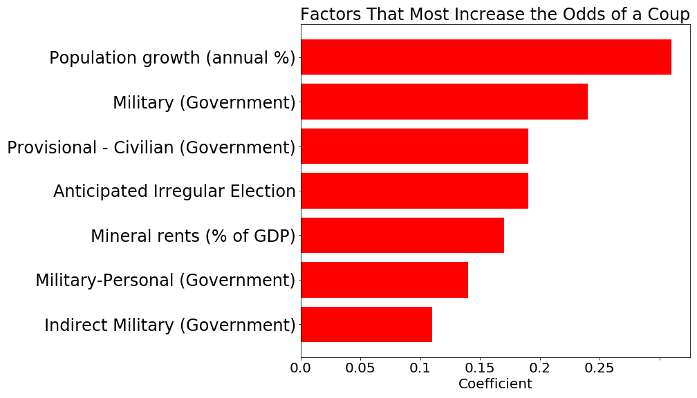
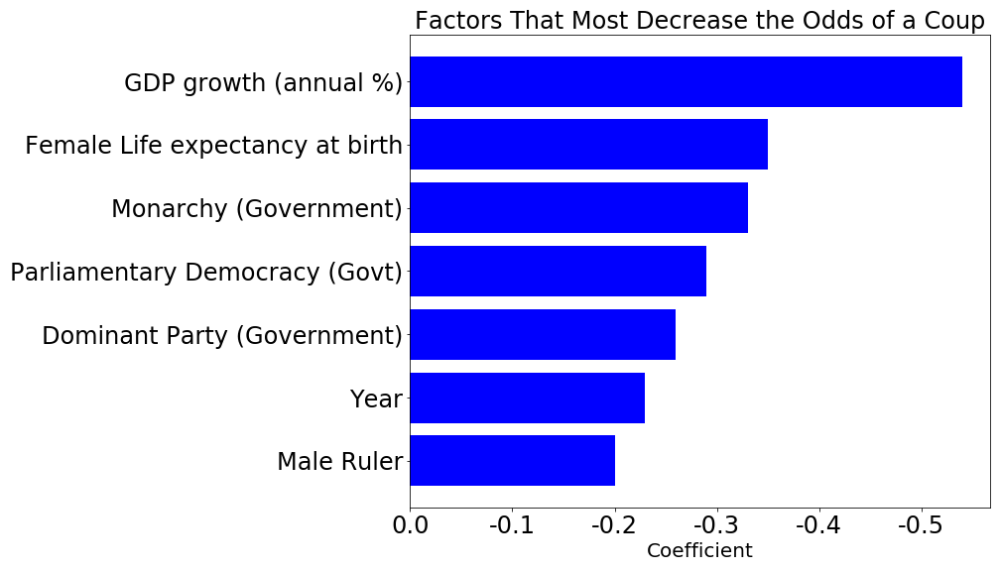

# Modeling Military Coups 

A protestor with a flag representing the indigenous communities of the Andes makes an entreaty to solidiers in Bolivia in 2019. [Source](https://www.mintpressnews.com/media-silent-bolivia-massacre-indigenous-protesters/262858/)

## Introduction

I spent a few years living in Argentina and travelled around South America, and I was always struck by how much of their 20th century history was defined by military coups, which often led to periods of chaos, repression, and terrible atrocities. Just in the last year, Evo Morales was driven from power in Bolivia and mercenaries attempted to overthrow Nicolas Maduro in Venezuela, and amid the chaos of the coronavirus outbreaks, there are rumblings of a military takeover in Brazil to shore-up Jair Bolsonaro's government. This shows that while the geopolitical context has somewhat changed from the Cold War era, the threat of military coups is ongoing.  

As I began working on data science and thinking about different machine learning techniques, I became curious as to whether I could apply machine learning techniques to predict when coups happen in different countries based on economic and political statistics. Fortunately, I discovered that political scientists were also interested in this question, and had created a dataset that tracked military coups called REIGN. I decided to try to create my own model using REIGN and supplementary data from the World Bank to see if I could model coups fairly accurately and see what features influenced the occurence of coups. 

## The Data

I used the REIGN dataset (see citation below) from One Earth Future for details on country leaders, government types, and when successful and attempted coups occured. I supplemented this with indicators from the World Bank's World Development Indicators.

The Reign dataset contained 135,637 rows covering January 1950 unitl March 2020, with 200 countries, 466 attempted coups (successful or unsuccessful) and 233 successful ones.

By filtering the dataframe for months in which attempted coups took place and a certain country, it was sometimes possible to trace their tumultuous journey through the latter half of the 20th century. For instance, looking at Argentina below, you can see the overthrow of Juan Perón in 1955, followed by a decade and a half of successive coups. Perón returned to Argentina in 1973 but died the following year – his Vice President and wife, Isabel, took power, but was overthrown in 1976 and replaced by a brutal military junta that persisted until the disastrous Falklands War.  

To supplement the REIGN dataset, I downloaded the full set of World Development Indicators from the World Bank, which consists of over 1700 indicators. Unfortunately, I was often constrained by when and how widely different indicators were collected: often demographic information was widely recorded, but metrics like the Gini Index, which I thought would be very interesting to analyze, were just too sparse to make use of. 

## Data Cleaning

In order to make the REIGN data more reasonable to predict on (and to make the granularity of the data match up with the other datasets), I decided to pull out the information from January of each year for every country, but added a column to track whether at least one coup or coup attempt happened during that entire year.  

In many ways, the largest challenge of this project was finding an effective way to merge the REIGN and World Bank datasets, which were both organized differently and often used different names for the same country. I created a dictionary that associated the names of World Bank countries with the equivalent country code in the REIGN dataset, and used this to create a function that pulled out interesting indicators from the World Bank data, reshaped them to match the REIGN data, and assigned a unqiue "year code" based on a combination of the REIGN country code and the year that could be used to merge the indictator with the equivalent country-year row from the REIGN data. 

## EDA

Overall, coups appear to have spiked in the 1960's and subsequently declined, albeit with spikes in the mid-1970's (probably linked to operation CONDOR in South America) and the early 1990's (likely linked to the instability caused by the fall and dissolution of the USSR.)

Bolivia had the largest number of both coups and attempted coups, with a number of other Latin American nations in the top 15.

Personal Dictatorships and Presidential Democracies suffered the greatest number of coups overall. This would seem to indicate that coups tend to occur (overall) in places which power is invested in a single person, whether democratically or not. 

When scaled by the number of months that each government type existed in the dataset, however, the interim government types (provisional civilian and provisional military) experienced the highest rate of coups, with indirect military rule also experiencing a high rate. This suggests, fairly intuitively, the government types associated with instability or miltary rule experience the most coups.

Likewise, when looking at leader tenures, the largest number of coups happen within the first year of a leader's rule

World Bank Demographic and Trade Information

## Modeling 

A major challenge in modeling was the extreme imbalance of the classes: out of 135,637 thousands rows in the REIGN data, only 466 had an attempted coup. A model that always predicted a coup wouldn't happen would automatically feature an accuracy upwards of 99.5%, but would completely miss the point of the investigation. Instead of focusing on accuracy, I was really curious about training a model with strong recall. However, the thing I really cared about was interpretability of the model, so I decided to first focus on a creating an inferential model using a logistic regression. 

In order to deal with the problem of imbalanced classes, I experimented with several techniques while evaluating the performance of a simple logistic regression. I found that oversampling and SMOTE tended to perform fairly well, but oversampling offered slightly better performance, so I used it as my resampling method (however, in my pipeline I did build in the option to try downsampling and SMOTE instead.) I also made sure to stratify my target column when using a test train split to ensure that the model would have a reasonable number of targets to predict on when I tested it. 

I experimented with using Variance Inflation Factors to identify collinear features, but instead decided to use a logistic regression with L1 regularization to pull features to 0. After dropping those features, I used a logistic regression with 5-fold cross validation and an elastic net regularizer to derive a list of relative feature importances and their direction:

## Results: Logistic Regression

| Metric | Value |
|--------|-------|
| Accuracy| 75% |
| Recall|  91% |

## Coefficients

Below are the largest positive and negative beta coefficients for the model trained on scaled data:

## Strongest Negative Indicators

# Is the U.S. about to experience a military coup?

As I was working on this project, protests in response to the murder of George Floyd enveloped the United States, and there began to rumblings of American troops deployedd within the United States to quell the unrest. While my data didn't extend to 2020, I decided to create a hypothetical row of data for the U.S. in June 2020 to see what the model would predict. 

It suggested a 26% probability for U.S. June 2020 (for 2016 it was 22%) – and given that the model offered a precision of around 1 in 10, at least according the model, a coup is very unlikely. 

## Citations

### REIGN Dataset

Bell, Curtis. 2016. The Rulers, Elections, and Irregular Governance Dataset (REIGN). Broomfield, CO: OEF Research. Available at oefresearch.org

The REIGN Dataset was constructed using the following resources:

Goemans, Henk E., Kristian Skrede Gleditch, and Giacomo Chiozza. 2009. "Introducing Archigos: A Dataset of Political Leaders" Journal of Peace Research, 46(2): 269-183. {{http://privatewww.essex.ac.uk/~ksg/archigos.html}}

Ellis, Cali Mortenson, Michael C. Horowitz, and Allan C. Stam. 2015. "Introducing the LEAD Data Set." International Interactions, 41(4): 718-741. {{http://www.tandfonline.com/doi/abs/10.1080/03050629.2015.1016157}}

Marshall, Monty G., Ted Robert Gurr, and Keith Jaggers. 2016. Polity IV Project. Center for Systemic Peace. {{http://www.systemicpeace.org/inscr/p4manualv2015.pdf}}

Barbara Geddes, Joseph Wright, and Erica Frantz. 2014. “Autocratic Regimes and Transitions.” Perspectives on Politics. 12(2).{{http://dictators.la.psu.edu/}}

Powell, Jonathan & Clayton Thyne. 2011. Global Instances of Coups from 1950-Present. Journal of Peace Research 48(2):249-259.{{http://www.jonathanmpowell.com/coup-detat-dataset.html}}

Erik Melander, Therése Pettersson, and Lotta Themnér (2016) Organized violence, 1989–2015. Journal of Peace Research 53(5) {{http://www.pcr.uu.se/research/ucdp/datasets/replication_datasets/}}

